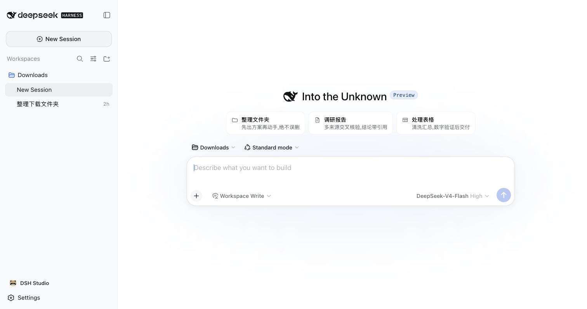
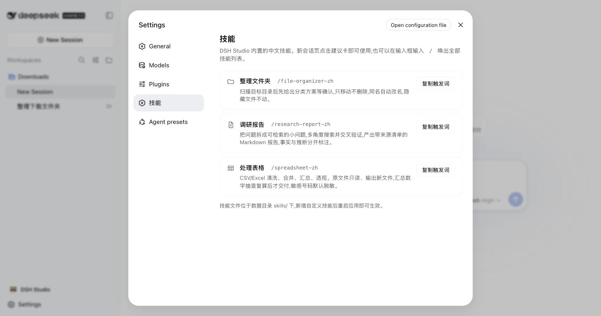

<div align="center">


# DSH Studio

**桌面上的 AI 数字同事 · Your AI coworker on the desktop**

下载即用的开源桌面 AI 工作台,基于 [DeepSeek Harness](https://github.com/deepseek-ai/deepseek-harness)。
自然语言派活,AI 在本机沙箱里真的动手干——每一步可审批、可回放。

An open-source desktop AI workbench built on DeepSeek Harness (dsh).
Download and go: assign tasks in plain language, the AI actually does the work
in a local sandbox — every step approvable and replayable.

[](https://github.com/dsh-studio/dsh-studio/actions)
[](LICENSE)


🚧 **Alpha 开发中** — 目标 2026-09,当前构建可从 [Actions](https://github.com/dsh-studio/dsh-studio/actions) 产物下载。

</div>

## 为什么是 DSH Studio

[dsh](https://github.com/deepseek-ai/deepseek-harness) 很强,但官方形态是开发者工具:要装 Node、开终端、会配 profile。
DSH Studio 把这段路砍掉,给不碰终端的中文用户一个能直接上手的 dsh:

- **双击即用**:安装包内置裁剪版 Node 与 dsh runtime,零环境配置,首启只需填一个 API key
- **原汁原味**:窗口里就是官方 dsh-web 深度体验(会话、审批、计划、轨迹),不是二次仿制;所有定制经官方插件机制注入,升级跟着上游走
- **中文开箱**:内置中文技能——整理文件夹 / 调研报告 / 处理表格——新会话页点卡片即派活,设置里有技能管理面板
- **多模型接入**:DeepSeek 官方直连,预设硅基流动(注册送体验额度)与 OpenRouter;任何 OpenAI / Anthropic 兼容端点均可配置
- **本机与隐私**:AI 在本机沙箱动手,数据不出本机;动文件前先出方案等确认,过程可回放

## 截图

| 新会话:技能建议卡 | 设置:技能管理 |
|---|---|
|  |  |

## 安装

> Alpha 阶段构建未签名:macOS 首次打开需右键 → 打开;Windows 需在 SmartScreen 提示中选择"仍要运行"。

- **macOS**(Apple Silicon):从 [Actions 构建产物](https://github.com/dsh-studio/dsh-studio/actions) 下载 `DSH Studio.app`,拖入应用程序文件夹
- **Windows**(x64):同上下载 NSIS 安装器,双击安装(按用户安装,无需管理员)

首次启动按引导配置模型:[DeepSeek 官方 API](https://platform.deepseek.com) 或在 设置 → Models 里使用预设的第三方接入。

## 技能

技能是教 AI"这类活该怎么干"的中文说明书。内置技能来自 [dsh-studio-skills-zh](https://github.com/dsh-studio/dsh-studio-skills-zh),
也可单独装给 dsh CLI 使用。自定义技能放进应用数据目录的 `skills/` 后重启即生效;
会话输入框输入 `/` 可唤出全部技能。

## 生态仓库

| 仓库 | 用途 |
|---|---|
| [dsh-studio-skills-zh](https://github.com/dsh-studio/dsh-studio-skills-zh) | 中文技能包(本应用内置技能的上游;独立可用于 dsh CLI) |
| [dsh-guide-zh](https://github.com/dsh-studio/dsh-guide-zh) | DeepSeek Harness 中文入门指南(装 CLI、接国产模型、常见坑) |

## 从源码开发

```bash
# 1. 组装捆绑 runtime(mac;Windows 用 prepare-runtime-win.sh)
bash spike/prepare-runtime.sh

# 2. 构建客户端插件
cd spike/plugins && pnpm install && pnpm -r run bundle

# 3. 开发运行
cd ../app && pnpm install && pnpm tauri dev
```

架构一句话:**Tauri 壳 + 捆绑官方 dsh runtime + 标准插件注入**。壳启动本机 host(`dsh web`,仅监听 127.0.0.1),
窗口加载官方 Web 界面;品牌、供应商预设、皮肤、技能面板都是独立的 dsh 插件(`spike/plugins/`),不 fork 上游一行代码。
内置技能从 skills-zh 仓同步到 `spike/skills/`(手动 `cp`,改动技能请去上游仓提交)。

## License

MIT · 本项目为社区项目,与 DeepSeek 官方无隶属关系。
Community project, not affiliated with DeepSeek.
