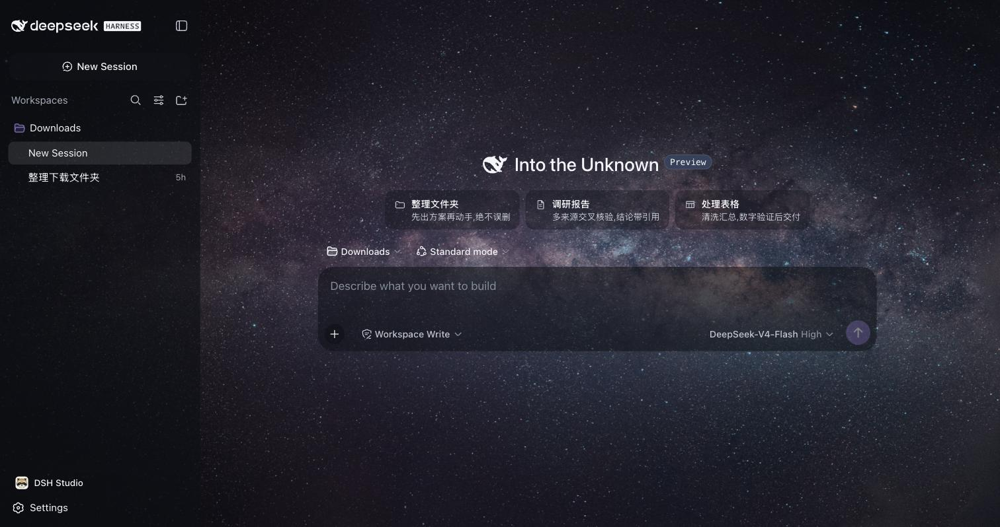
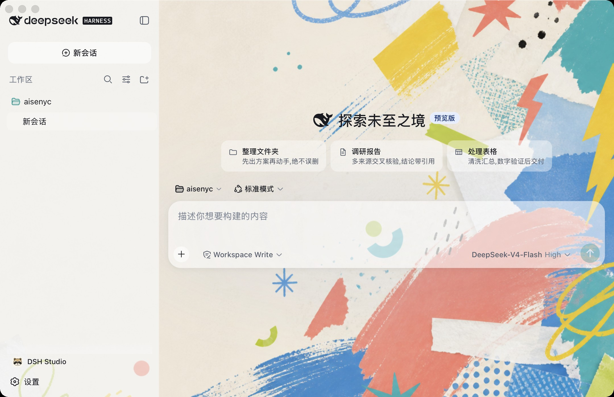
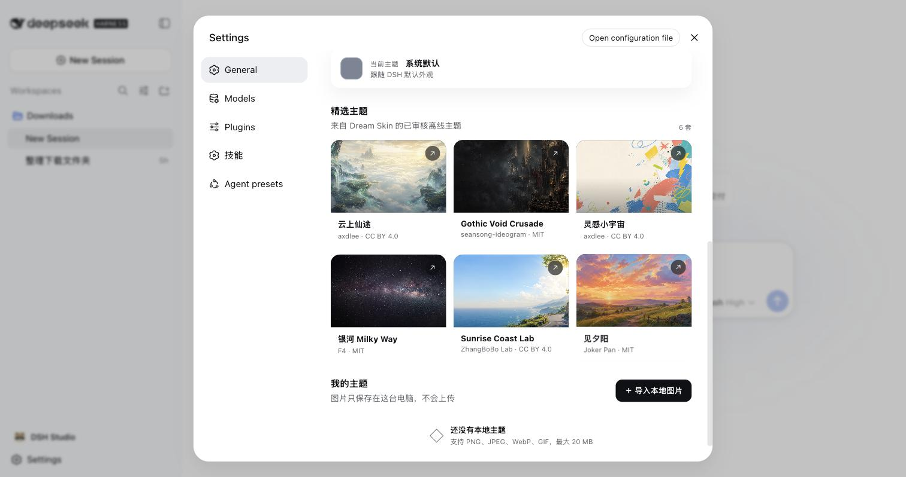

<div align="center">


# DSH Studio

**桌面上的 AI 数字同事 · Your AI coworker on the desktop**

下载即用的开源桌面 AI 工作台,基于 [DeepSeek Harness](https://github.com/deepseek-ai/deepseek-harness)。
自然语言派活,AI 在本机沙箱里真的动手干——每一步可审批、可回放。

An open-source desktop AI workbench built on DeepSeek Harness (dsh).
Download and go: assign tasks in plain language, the AI actually does the work
in a local sandbox — every step approvable and replayable.

[](https://github.com/dsh-studio/dsh-studio/actions)
[](LICENSE)


🚧 **Alpha 开发中** — 目标 2026-09,当前构建可从 [Actions](https://github.com/dsh-studio/dsh-studio/actions) 产物下载。

</div>

## 最新进展 · Unreleased

DSH Studio 已把首批 DeepSeek Harness 生态能力装进同一个本机应用。除品牌、模型供应商、Dream Skin 主题、中文技能面板和组件管理外,现在还包含 Better Sidebar、`@` 文件引用、Agent Teams、ModLens、Browser、TUI 和只读 Market。

- 在 **设置 → 工作台组件** 查看版本、来源、权限和运行状态
- Better Sidebar、`dsh-at-file` 和 Agent Teams 默认启用;ModLens、Browser、TUI 和 Market 按需开启
- Browser 可准备锁定的 Chrome 扩展,TUI 在独立终端运行,Market 只读取本地固定目录而不安装或卸载插件
- 可修复组件或以安全模式重启;新组合启动失败会回滚,并最多自动尝试一次安全模式
- 只管理 Studio 自带条目,不覆盖会话、主题、模型配置或用户自行安装的 dsh 插件

查看[工作台组件说明](#工作台组件) 和[完整更新记录](CHANGELOG.md)。

## 为什么是 DSH Studio

[dsh](https://github.com/deepseek-ai/deepseek-harness) 很强,但官方形态是开发者工具:要装 Node、开终端、会配 profile。
DSH Studio 把这段路砍掉,给不碰终端的中文用户一个能直接上手的 dsh:

- **双击即用**:安装包内置裁剪版 Node 与 dsh runtime,零环境配置,首启只需填一个 API key
- **原汁原味**:窗口里就是官方 dsh-web 深度体验(会话、审批、计划、轨迹),不是二次仿制;所有定制经官方插件机制注入,升级跟着上游走
- **中文开箱**:内置中文技能——整理文件夹 / 调研报告 / 处理表格——新会话页点卡片即派活,设置里有技能管理面板
- **生态工作台**:内置增强侧边栏、`@path` 引用和 Agent Teams;视觉、浏览器、TUI 与只读插件目录可按需开启
- **一键换肤**:内置 Dream Skin 精选主题(壁纸级皮肤,附创作者署名),也能把自己的图片乃至动图做成专属皮肤,亮度、焦点、面板透明度随手调
- **多模型接入**:DeepSeek 官方直连,预设硅基流动(注册送体验额度)与 OpenRouter;任何 OpenAI / Anthropic 兼容端点均可配置
- **本机与隐私**:AI 在本机沙箱动手,数据不出本机;动文件前先出方案等确认,过程可回放

## 截图

一套工作台,两种性格——Dream Skin 主题随心切换:

| 「银河 Milky Way」·沉浸专注 | 「灵感小宇宙」·明快创意 |
|---|---|
|  |  |

| 新会话:技能建议卡 | 设置:技能管理 | 设置:Dream Skin 主题库 |
|---|---|---|
|  |  |  |

## 安装

> Alpha 阶段构建未签名:macOS 首次打开需右键 → 打开;Windows 需在 SmartScreen 提示中选择"仍要运行"。

- **macOS**(Apple Silicon):从 [Actions 构建产物](https://github.com/dsh-studio/dsh-studio/actions) 下载 `DSH Studio.app`,拖入应用程序文件夹
- **Windows**(x64):同上下载 NSIS 安装器,双击安装(按用户安装,无需管理员)

首次启动按引导配置模型:[DeepSeek 官方 API](https://platform.deepseek.com) 或在 设置 → Models 里使用预设的第三方接入。

## 技能

技能是教 AI"这类活该怎么干"的中文说明书。内置技能来自 [dsh-studio-skills-zh](https://github.com/dsh-studio/dsh-studio-skills-zh),
也可单独装给 dsh CLI 使用。自定义技能放进应用数据目录的 `skills/` 后重启即生效;
会话输入框输入 `/` 可唤出全部技能。

## 皮肤

设置 → 通用 → 主题皮肤:

- **Dream Skin 精选**:内置六款离线主题(云上仙途、银河、日出海岸、日落远航等),壁纸 + 配色 + 面板效果成套切换,亮暗外观自动适配
- **自制皮肤**:导入本地图片(支持动图)即可生成专属主题,可调整画面焦点、亮度与面板透明度,保存为"我的本地主题"随时编辑

皮肤是标准 dsh 插件实现,主题文件为开放的 JSON + 图片格式——欢迎社区投稿新主题。

## 工作台组件

设置 → 工作台组件可查看 Studio 自带组件的版本、来源、权限与运行状态。所有组件都在构建时离线组装并用 SHA-256 锁定;本机启动时再次校验。

- 核心组件始终开启,可选组件关闭后只移除 Studio 管理的 Profile 条目
- 新组合只有在本地 host ready 后才生效;启动失败会回滚到上一组可用状态,并最多自动尝试一次安全模式
- 组件修复与安全模式不会删除会话、模型配置、主题,也不会覆盖用户自行安装的 dsh 插件

本次接入的生态组件:

| 组件 | 默认 | 在 Studio 中的作用 |
|---|---:|---|
| Better Sidebar `0.16.1` | 开 | 文件浏览、编辑、终端与增强侧边栏;唯一的外部工作区 Shell |
| `dsh-at-file` `0.4.0` | 开 | 在输入框搜索并插入 `@path` 工作区引用 |
| Agent Teams `0.1.13` | 开 | 队长、成员、任务依赖、消息与团队活动面板 |
| ModLens `3.25.0` | 关 | 为文本模型提供图片读取与视觉桥接 |
| DSH Browser bridge `0.0.2` / 扩展 `0.1.1` | 关 | 准备锁定的 Chrome 扩展并通过本机桥接控制用户选定标签页 |
| DSH TUI `0.9.3` | 关 | 在独立 Terminal 窗口运行隔离的 `dsh-tui` Profile |
| DSH Market `1.31.1` | 关 | 搜索固定的官方插件目录快照;不开放安装、更新或卸载路由 |

Dream Skin 仍是唯一主题引擎,不会与 Better Sidebar 争夺换肤。`dsh-web-ui` 与当前 Shell/UI 重复,暂不接入;`dsh-memory` 和 `dsh-hud` 因同名来源尚未选定,也继续暂缓。

## 生态仓库

| 仓库 | 用途 |
|---|---|
| [dsh-studio-skills-zh](https://github.com/dsh-studio/dsh-studio-skills-zh) | 中文技能包(本应用内置技能的上游;独立可用于 dsh CLI) |
| [dsh-guide-zh](https://github.com/dsh-studio/dsh-guide-zh) | DeepSeek Harness 中文入门指南(装 CLI、接国产模型、常见坑) |

## 从源码开发

```bash
# 1. 组装捆绑 runtime(mac;Windows 用 prepare-runtime-win.sh)
#    Web/React 18 与 TUI/React 19 会安装到两棵隔离依赖树
bash spike/prepare-runtime.sh

# 2. 构建客户端插件
cd spike/plugins && pnpm install && pnpm -r run bundle

# 3. 锁定并组装工作台组件
cd .. && node workbench/assemble.mjs

# 4. 开发运行
cd app && pnpm install && pnpm tauri dev
```

架构一句话:**Tauri 壳 + 捆绑官方 dsh runtime + 可回滚的标准插件工作台**。壳启动本机 host(`dsh web`,仅监听 127.0.0.1),
窗口加载官方 Web 界面;Studio 自有插件与经过固定提交/版本审查的生态插件由 `spike/workbench/` 离线组装,不 fork 官方 dsh。Web 和 TUI 使用隔离依赖树,避免 React 主版本互相覆盖。
内置技能从 skills-zh 仓同步到 `spike/skills/`(手动 `cp`,改动技能请去上游仓提交)。

## License

MIT · 本项目为社区项目,与 DeepSeek 官方无隶属关系。
Community project, not affiliated with DeepSeek.
